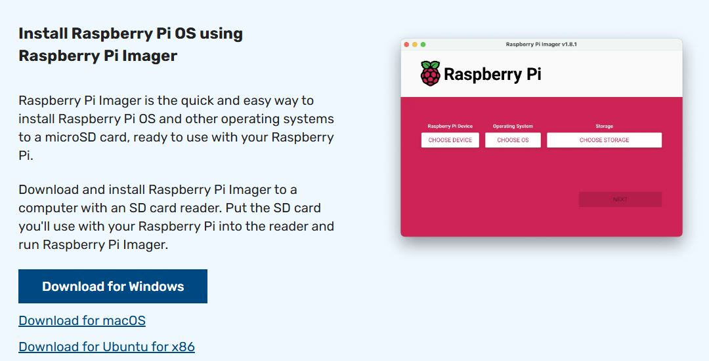

# Raspberry-server-
Este respositorio cuenta con los pasos a seguir y comandos para instalar, crear y modificar los programas necesarios para montar un proyecto IoT con envio de datos a través de MQTT, utilizando Node-Red y MYSQL.

## Materiales necesarios:

1. Raspberry Pi 4 modelo B 8Gb.

2. Micro-Sd 32Gb.

3. convertidor Usb a MicroSd.

5. Cable mini-HDMI a HDMI.

6. Pantalla o Monitor.

7. Teclado y Mouse.

8. fuente de alimentación de Raspberry Pi 4.

## Instalación del Sistema operativo y programas necesarios:

Empezaremos descargando la herramienta [Raspberry pi imager](https://www.raspberrypi.com/software/) en nuestro sistema



Posteriormente insertaremos la Micro-Sd en el adaptador Usb y la conectaremos a la computadora, continuaremos ejecutando el programa Raspberry pi imager, en el cual seleccionaremos el dispositivo que ocuparemos(para este caso sera la raspberry pi 4), el sistema operativo que le instalaremos (Raspberry pi OS (64bit)y la undad de almacenamiento en donde haremos la instalación(la undad que aparece la MicroSd que insertamos previamente). daremos al boton de next y nos mostrara una pantalla en la cual podremos configurar algunos aspectos como lo son el usuario, contraseña, red wifi, asi como habilitar opciones como ssh.

Al finalizar la instalación expulsaremos la Micro-Sd de nuestro pc y la retitaramos del adaptador para colocarla en la ranura de nuestra RaspBerry Pi 4, conectaremos el teclado y mouse a los puertos usb de la raspberry, asi como el cable de hdmi a la pantalla, conectaremos el cblae de la fuente de alimentación y la encenderemos.

En el escritorio de inicio verificaremos que en la parte superior derecha nos encontremos conectados a la red que stablecimos en la configuracion, de no ser asi la buscaremos en las opciones e introduciremos la contraseña, una vez conectados a la red abriremos una terminal dano click en el simbolo del lado superior izquierdo o presionando la teclas Ctrl+alt+t.
Dentro de la terminal empezaremos por acutalizar el sistema con los sguientes comandos:
```
sudo apt upgrade

```
```
sudo apt update

```
### Instalación de Broker MQTT

Para La instalación de un broker MQTT abriremos la terminal y utilizaremos los siguientes comandos:
```
sudo apt install mosquitto

```
```
sudo apt install mosquitto-clients

```

Revisaremos que el programa esté corriendo adecuadamente con el comando: 
```
systemctl status mosquitto

```
### Instalación de Node-Red

Para la instaación de Node-Red abriremos la terminal y utilizaremos los siguientes comandos:

```
bash <(curl -sL https://raw.githubusercontent.com/node-red/linux-installers/master/deb/update-nodejs-and-nodered)

```
 - le daremos que si a las opciones con la letra "Y" para poder completar la instalación. 

Pedirá la confirmacion de la dirección donde se guardaran los archivos el cual será "home/(nombre de tu usuario)/.node-red/settngs.js"

 - daremos la la opcion "no"
 - daremos que "yes" a la opción "Doyou want to enable the Proyects feature?"
 - manual.
 - default. 
 - moncao (default).
 - "yes"  a "Allow Function nodes to load external modules (functionExternalModules)"

Para inicar node-red introduciremos el comando 
```
node-red

```
desplegara una direccion ip a la cual le daremos click+ctrl para ingresar al programa.


